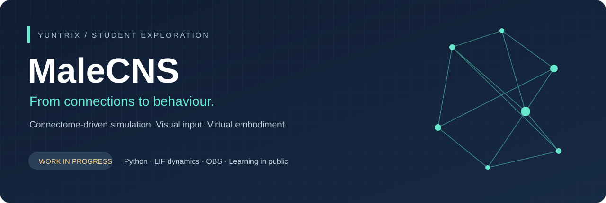
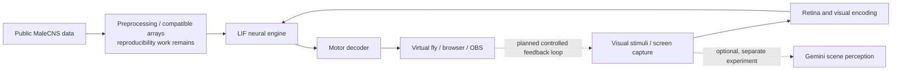
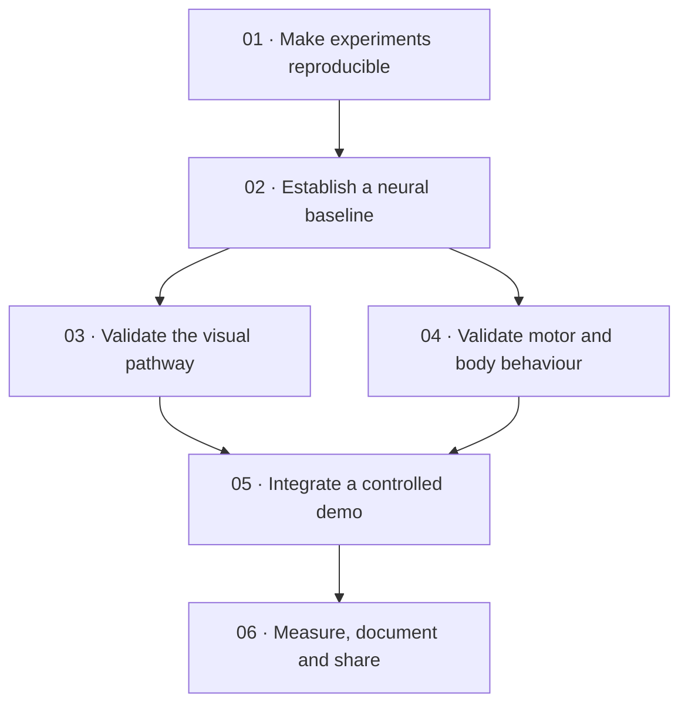

<p align="center"></p>

<p align="center"><strong>An independent CS student project exploring how connectome data can drive a virtual fly.</strong><br>Built by <a href="https://github.com/Yuntrix">Yuntrix</a> · CS student at PJATK, Warsaw · Work in progress</p>

<p align="center"><a href="#the-idea">The idea</a> · <a href="#current-state">Current state</a> · <a href="docs/ROADMAP.md">Roadmap</a> · <a href="https://github.com/users/Yuntrix/projects/3">Live project board</a> · <a href="docs/MaleCNS-Roadmap.xlsx">Project sheet</a> · <a href="CONTRIBUTING.md">Contribute</a></p>

## The idea

Can a public fruit-fly connectome become the foundation for an understandable, interactive simulation that connects visual input to observable behaviour?

I am learning by building a system around that question. MaleCNS brings together a leaky integrate-and-fire (LIF) neural simulation, visual-input experiments, motor decoding and a virtual fly rendered in a browser/OBS environment. My interests are low-level reasoning, optimization, automation and solving concrete engineering problems.

This is my first public project. It is still experimental, and I use GPT-assisted coding and debugging while learning, testing and refining the implementation. Feedback, corrections and small, focused contributions are welcome.

## What I want to build

The working direction is a reproducible environment where a virtual fly receives controlled visual stimuli, evolves through neural simulation and produces inspectable movement. A useful first milestone would let another person set it up, run the same experiment and understand how an input became a motor response.

The planned outcome includes:

- A documented route from public connectome data to compatible simulation inputs.
- A clearly identified combination of vision, neural-engine and overlay components.
- A small set of repeatable scenarios for visual response, steering and spontaneous activity.
- Measurements of latency, stability and behaviour, with limitations recorded alongside results.
- A clean demo and contributor guide that make further exploration easier.

These are development goals. The repository does not claim a complete, conscious or biologically validated fly, and it is not an official project of the data providers or PJATK.

## Current state

| Area | What is present | What still needs work |
| :--- | :--- | :--- |
| Neural core | LIF engines, continuous and multi-input sessions | Reproducible inputs and documented validation |
| Visual input | Screen capture, retina and laterality experiments | Select and verify a compatible pipeline |
| Motor output | Motor decoders and steering experiments | Validate mappings and response metrics |
| Virtual environment | Browser/OBS overlays, character model, habitat code | Verify an end-to-end demonstration |
| Optional perception | Gemini screen-description experiments | Evaluate usefulness, privacy and model configuration |
| Collaboration | Source inventory, roadmap and setup notes | Community review and focused fixes |

**Source inspection is not runtime validation.** The Python files pass a syntax check, but full simulation, timing and biological behaviour have not been verified as part of publication. Earlier versions and experimental filenames remain intact.

## How the pieces fit



The diagram describes the intended architecture. It does not imply that all experimental versions are already integrated. Gemini perception is shown separately because its role in the final control loop remains exploratory.

## Roadmap



See the [detailed roadmap and acceptance criteria](docs/ROADMAP.md), the [editable Excel project sheet](docs/MaleCNS-Roadmap.xlsx), or the [GitHub-readable CSV](docs/roadmap.csv). Priorities are a proposed development sequence, not promised dates or a completion percentage.

## Explore the code

```text
MaleCNS/
├── lif_engine*.py              # Neural dynamics and simulation engines
├── brain_session*.py           # Continuous and multi-input sessions
├── motor_decoder*.py           # Neural activity to motor outputs
├── vision_bridge*.py           # Screen-to-input experiments
├── visual_retina_encoder*.py   # Retina mappings (also visiual_* variants)
├── obs_overlay_server*.py      # Browser / OBS visualization
├── body/                      # Character states and control
├── world/                     # OBS habitat and prop placement
├── vision/                    # Optional Gemini perception
├── assets/vendor/             # Local browser renderer
├── fly_master.glb             # Character model
├── data/                      # Data instructions and file inventory
└── docs/                      # Roadmap, project sheet and architecture
```

Version suffixes do not establish compatibility. Several `test_*.py` files are simulation experiments with top-level execution, not a conventional unit-test suite.

## Getting started

**This is a source-only release. The full neural simulation requires additional scientific data.** Start with [data setup](data/README.md) before attempting the simulation. The processed matrices must match the neuron table; raw downloads alone are not a verified reproduction recipe.

Python 3.12 reflects the original development environment. Dependencies were inferred from source imports and are not yet a tested lockfile.

```powershell
python -m venv .venv
.venv\Scripts\python.exe -m pip install -r requirements.txt
# After supplying the matching scientific data, run from the repository root:
.venv\Scripts\python.exe obs_overlay_server_v6.py
```

The overlay is configured for `http://127.0.0.1:8765/`. OBS integration needs an appropriately configured OBS WebSocket server. Tkinter is required by some demos. The main entry point is a candidate for validation, not a guaranteed stable release.

Optional credentials are read from `GEMINI_API_KEY` and `OBS_WEBSOCKET_PASSWORD` environment variables. No real values belong in the repository. The scripts do not automatically read `.env` files. Screen capture can include private desktop content; Gemini requests transmit captured content to an external API when that feature is used.

## Built on public science

The underlying [MaleCNS connectome](https://male-cns.janelia.org/) is a collaboration between **FlyEM at HHMI Janelia, the University of Cambridge, the MRC Laboratory of Molecular Biology and Google Research**. Their work supplies the anatomical data. This repository is an independent student simulation experiment built around it.

- [Official project and research links](https://male-cns.janelia.org/)
- [Official data downloads](https://male-cns.janelia.org/download/)
- [Release notes](https://male-cns.janelia.org/release/)

The official site labels the dataset CC-BY. Dataset terms are separate from the code and model assets in this repository. The existing Three.js MIT notice is retained in the renderer bundle. No project-wide code license has been selected yet; please open an issue to discuss reuse or contributions.

## Help shape the project

Useful starting points are data reproducibility, selecting compatible script versions, reviewing neuron-to-motor mappings and profiling the simulation. See [CONTRIBUTING.md](CONTRIBUTING.md) for scope and the evidence a helpful issue or pull request should include.

## Türkçe kısa açıklama

PJATK'ta bilgisayar bilimi öğrencisiyim. İlk herkese açık projemde, MaleCNS bağlantı verilerini kullanarak görsel girdiler ile sanal bir sineğin davranışları arasında incelenebilir bir simülasyon kurmayı araştırıyorum. GPT desteğiyle geliştiriyor ve öğreniyorum. Proje bitmiş değil; amaç tekrarlanabilir deneyler, anlaşılır bir mimari ve katkıya açık bir çalışma ortaya çıkarmak. Kod incelemesi ve teknik öneriler memnuniyetle karşılanır.
