
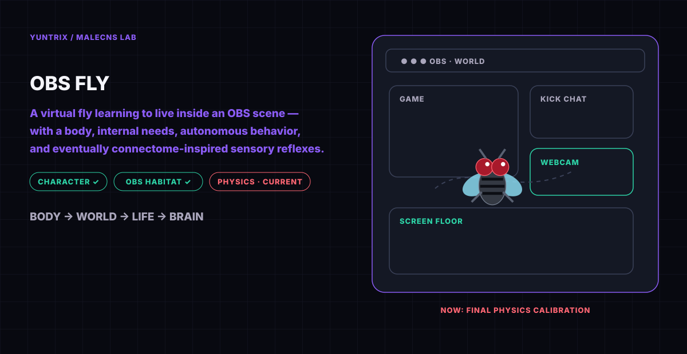

<h1 align="center">MaleCNS / OBS Fly</h1>

<h2 align="center">🚧 WORK IN PROGRESS 🚧</h2>

<strong>A virtual fly learning to live inside an OBS scene — with a body, internal needs, autonomous behavior, and eventually connectome-inspired sensory reflexes.</strong>

  <strong>Development build:</strong> the repository contains working foundations, ongoing experiments and planned systems. It is not yet a finished or stable release.

<a href="#idea">IDEA</a> · <a href="#character">CHARACTER</a> · <a href="#habitat">HABITAT</a> · <a href="#life">LIFE</a> · <a href="#brain">BRAIN</a> · <a href="#events">EVENTS</a> · <a href="#roadmap">ROADMAP</a>

<strong>NOW</strong> · Final physics calibration &nbsp; | &nbsp; <strong>NEXT</strong> · Watching and autonomous life &nbsp; | &nbsp; <strong>LONG-TERM</strong> · Vision → MaleCNS → reflex → body

---

## The project in one minute

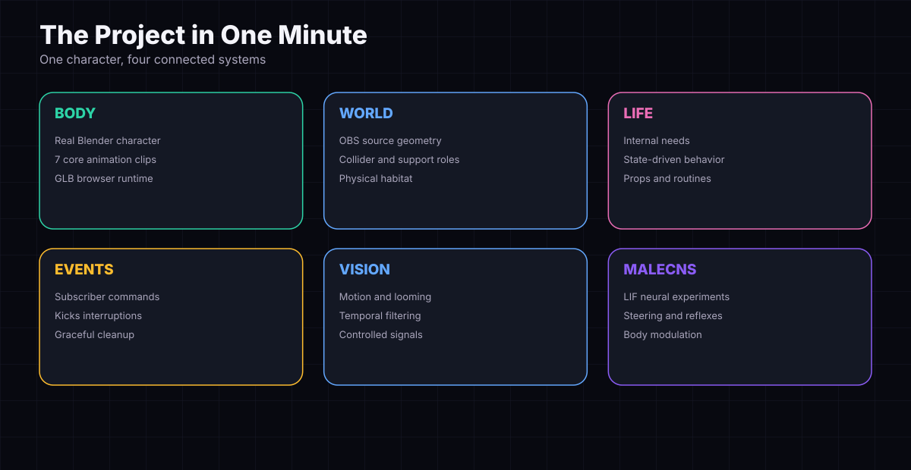

OBS Fly asks whether a stream overlay character can become more than a looping animation. The project starts with a real Blender body and an OBS scene treated as physical space. It then adds internal needs, autonomous behavior, viewer-driven events and, later, connectome-inspired sensory control.

> **Playful character. Serious system. Honest development.**

This is an independent student project and a work in progress. Concept graphics describe intended behavior; the current implementation state is identified explicitly below.

### A living OBS world

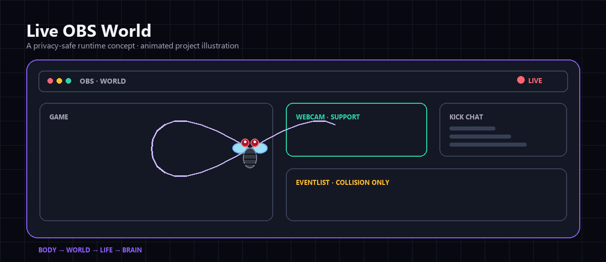

This privacy-safe runtime concept recreates the structure of the real OBS setup without exposing a webcam feed, chat messages or personal stream information. It shows the intended relationship between the fly, game area, chat, webcam support and collision-only event surfaces.

## Why I am building this

Can a virtual character develop needs, choose activities, respond to its environment and eventually receive biologically inspired sensory control? I am using that question to explore simulation, real-time systems, behavior architecture, visual input, optimization and AI-assisted engineering.

MaleCNS / OBS Fly is my first public project as a Computer Science student and game tester at PJATK in Warsaw. The project connects my interests in AI, automation, autonomous systems, simulation and tools for streaming/OBS.

## Meet the Fly

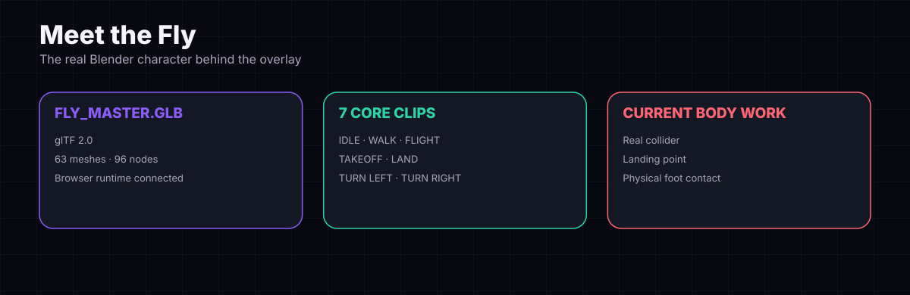

The character uses a real Blender model rather than a generic overlay sprite. Its large red eyes, compact dark body, wing proportions and mechanical low-poly legs define the visual identity used throughout the project.

| Model | Current asset information |
|---|---|
| Master export | `fly_master.glb` |
| Format | GLB / glTF 2.0 |
| Animation clips | 7 |
| Meshes / nodes | 63 / 96 |
| Runtime | Browser runtime connected |

**Current clips:** `FLY_IDLE` · `FLY_WALK` · `FLY_FLIGHT` · `FLY_TAKEOFF` · `FLY_LAND` · `FLY_TURN_LEFT` · `FLY_TURN_RIGHT`

## OBS is the habitat

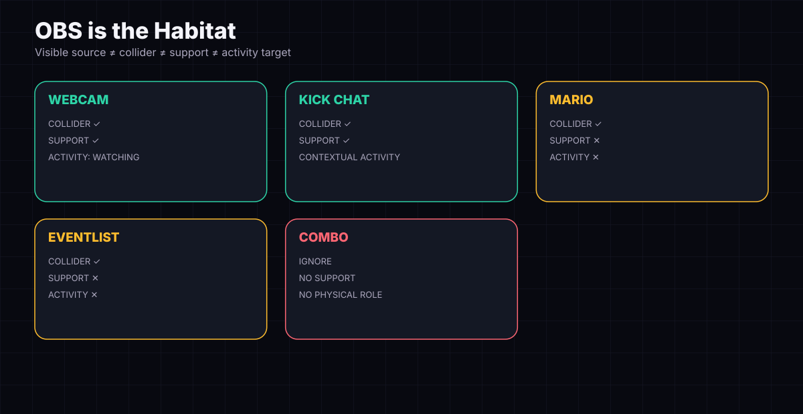

The OBS scene is treated as a world. Visible sources, physical colliders, support surfaces and activity targets are separate concepts. A panel may block movement without being safe to stand on, while a supported surface may also host a behavior such as watching.

| Source | Collider | Support | Activity role |
|---|:---:|:---:|---|
| Webcam | ✓ | ✓ | Watching target |
| Kick Chat | ✓ | ✓ | Contextual |
| Mario | ✓ | ✕ | None |
| Eventlist | ✓ | ✕ | None |
| Combo | Ignored | ✕ | No physical role |

## The Fly's daily life

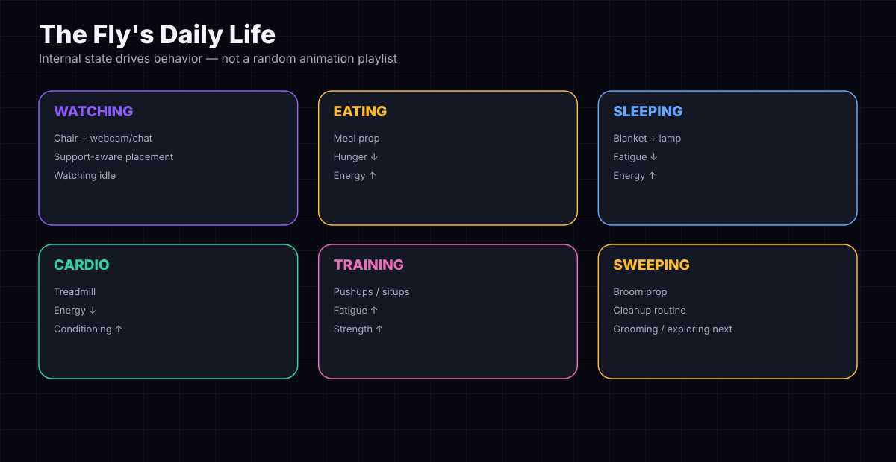

The target is a small autonomous life, not a random animation playlist. Internal state, available support surfaces, props, preconditions, costs and cooldowns will influence activity selection.

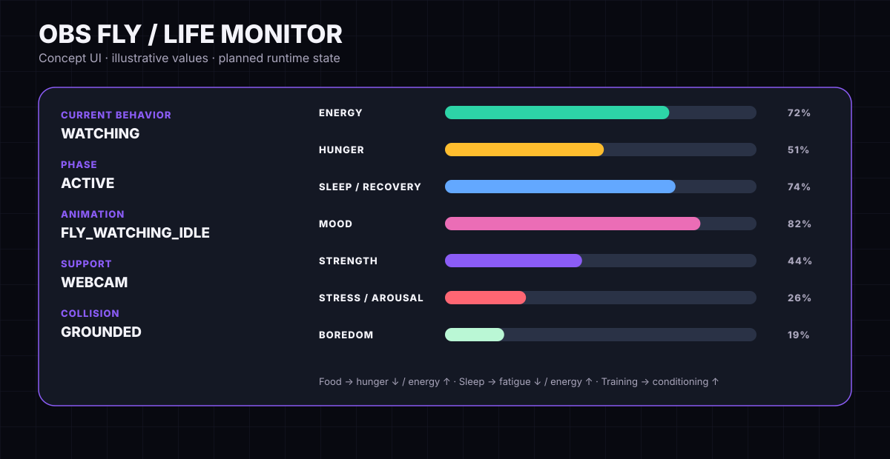

The dashboard is a concept for inspectable runtime state. Its displayed values are illustrative rather than live measurements.

## How a behavior happens

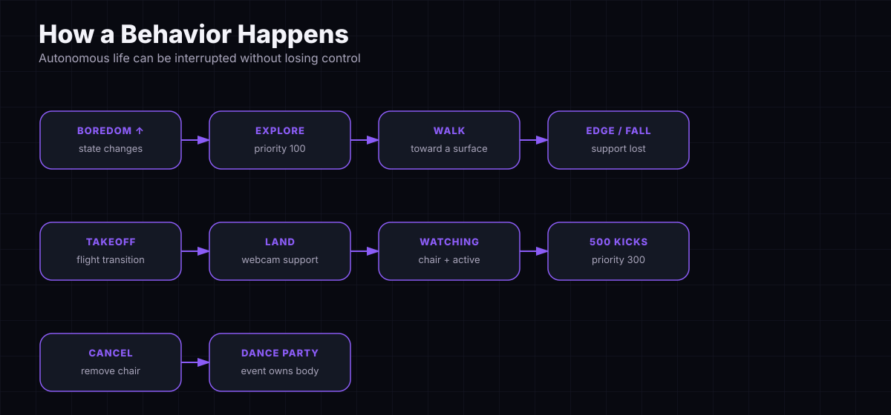

One planned example begins when boredom makes exploring attractive. The fly walks, loses support at an edge, transitions to flight, finds the webcam, lands and begins watching. If a 500 Kicks event arrives, Watching receives a cancellation request, removes its chair during cleanup and releases control to Dance Party. When the event is done, autonomous life resumes.

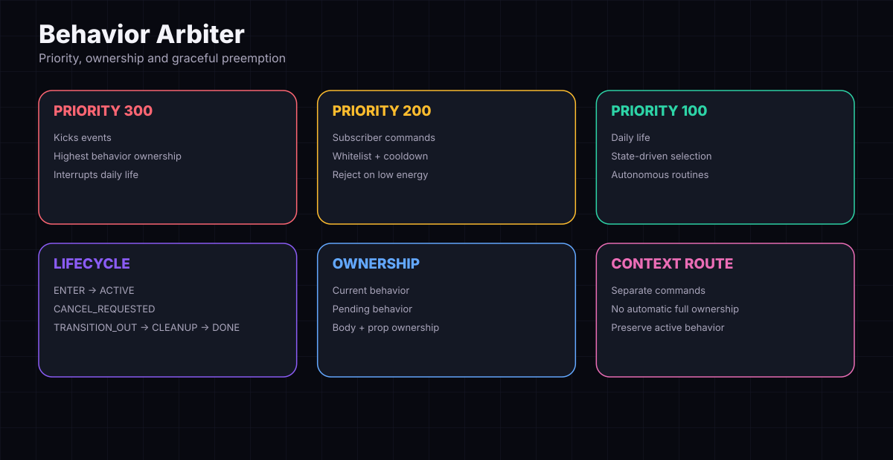

The arbiter prevents multiple systems from silently controlling the body at once. It tracks current and pending behavior, priority, phase, body ownership and prop cleanup.

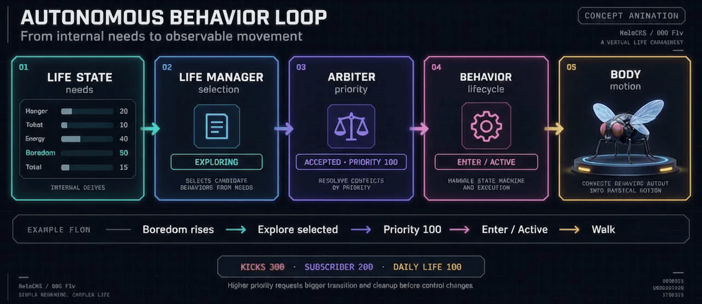

## Life and MaleCNS

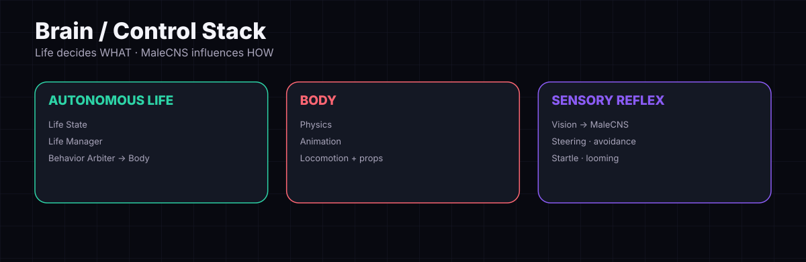

**Life decides what the fly is doing. MaleCNS will influence how its body reacts while doing it.** High-level behaviors such as eating or watching remain separate from short steering, avoidance, startle and looming responses.

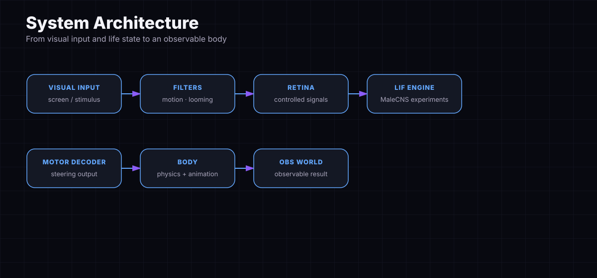

The long-term path connects controlled visual signals, retina encoding, LIF neural experiments, motor decoding and observable body movement. Semantic scene perception remains a lower-frequency, separate experiment and does not directly select behavior.

### MaleCNS foundation

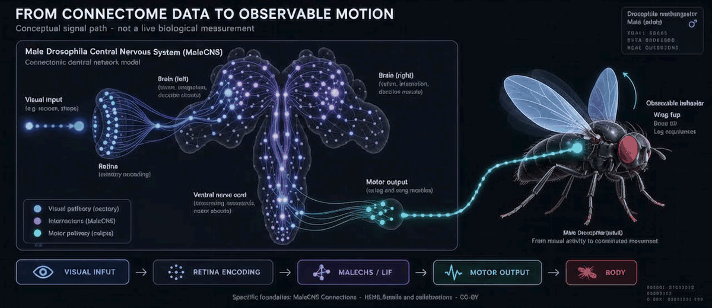

The scientific foundation is the [MaleCNS Connectome Project](https://male-cns.janelia.org/), a reconstruction of the full male *Drosophila* central nervous system by FlyEM at HHMI Janelia, the University of Cambridge Department of Zoology, the MRC Laboratory of Molecular Biology and Google Research. Its dataset is published under CC-BY. The animation above is an original conceptual visualization of the planned software signal path; it is not copied anatomical imagery and does not represent measured neural activity.

## Stream events

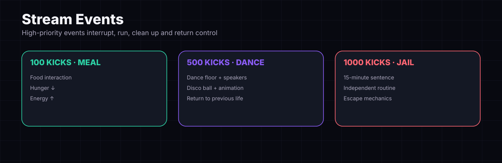

Viewer events are designed as high-priority behaviors that interrupt daily life, obtain ownership, run their sequence, clean up and return control.

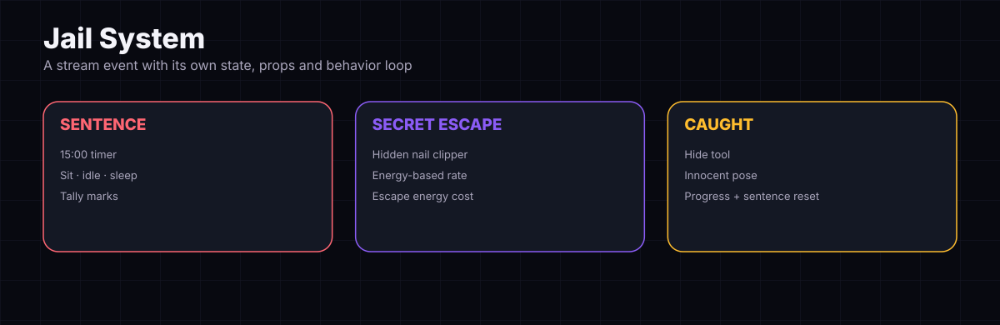

Jail is planned as a full behavior environment: a 15-minute sentence, sitting, idling, sleeping, tally marks, a hidden nail clipper, energy-based escape progress, an innocent pose and sentence/progress reset when the attempt fails.

## What exists today?

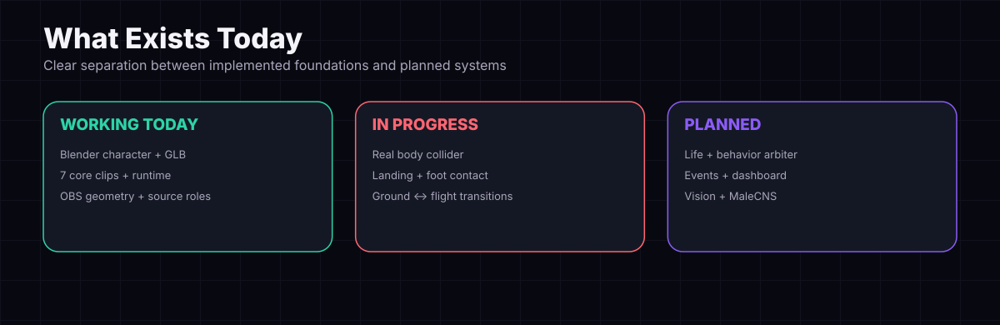

The character and OBS habitat foundations exist. Final physics calibration is current work. Autonomous life, commands, events, live dashboard and full Vision/MaleCNS integration remain development goals.

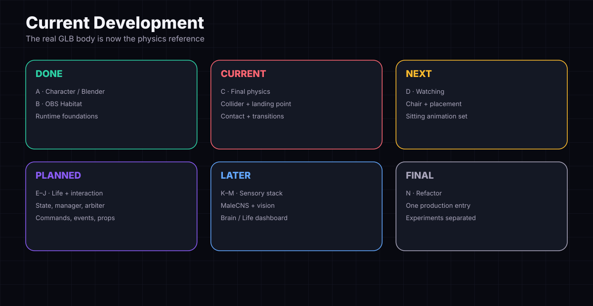

### Current physics checklist

- [ ] Final collider for the real GLB body
- [ ] Real landing point and physical foot contact
- [ ] Walking and standing footprints
- [ ] Flying collider
- [ ] Overlay edge and left/right collision tests
- [ ] Landing from above and collision from below
- [ ] Walk-off → fall behavior
- [ ] `SCREEN_FLOOR` behavior
- [ ] Ground ↔ flight transitions
- [ ] Remove the remaining placeholder measurements

## Full roadmap A → N

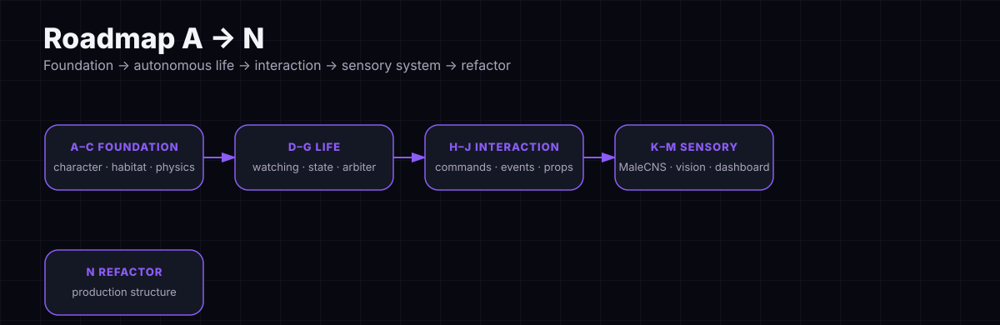

<strong>A. Character / Blender ✅</strong>

- Original low-poly cartoon fly, rig and master Blender file
- Seven core clips: idle, walk, flight, takeoff, land, turn left and turn right
- `fly_master.glb` export and OBS Browser Source connection
- Runtime animation playback, scale correction and grounding correction

<strong>B. OBS Habitat ✅</strong>

- WORLD scene used as the habitat; OBS sources enter the collision system
- Combo ignored; Mario and Eventlist remain collision-only
- Webcam remains a usable support
- Kick Chat geometry and placement corrected for normal, manual and Watching movement
- Physical collider, support and activity roles separated

<strong>C. Final Physics Calibration 🔴</strong>

- Real GLB body collider, landing point and physical foot contact
- Walking footprint, standing footprint and flying collider
- Overlay-edge sticking, left/right collision, landing and underside tests
- Walk-off falls, `SCREEN_FLOOR` and ground ↔ flight transitions
- Replace all remaining placeholder measurements with real character dimensions

<strong>D. Watching 🟠</strong>

- Real chair asset scaled to the character
- Walk or fly toward a valid position; define the sitting point
- Place chairs on Webcam and Kick Chat; reject unsuitable small surfaces
- Avoid repeated positions and add natural weighted placement
- `FLY_SIT_DOWN`, `FLY_SIT_IDLE`, `FLY_STAND_UP`, `FLY_WATCHING_IDLE`
- Clean up the chair correctly when interrupted

<strong>E. Life State</strong>

- Energy; hunger/satiety; fatigue/sleep pressure; strength/conditioning
- Stress/arousal; boredom/activity need; changes over time
- Walking, flying and exercise costs
- Sleep and food recovery; critical-energy behavior

<strong>F. Life Manager / Autonomous Life</strong>

- Resting, exploring, watching, sleeping, eating/snacking and grooming
- Sweeping, pushups and situps
- State-driven selection rather than random playback
- Cooldowns, preconditions, cost/benefit and behavior transitions

<strong>G. Behavior Arbiter</strong>

- Kicks Events = priority 300; Subscriber Commands = 200; Daily Life = 100
- `ENTER`, `ACTIVE`, `CANCEL_REQUESTED`, `TRANSITION_OUT`, `CLEANUP`, `DONE`
- Graceful preemption, current behavior and pending behavior
- Separate route for context commands

<strong>H. Subscriber Commands</strong>

- Subscriber verification, command whitelist and cooldowns
- `!cardio`, `!pushup`, `!situp`
- Reject requests when energy is insufficient
- `COMMAND_REJECTED_LOW_ENERGY` and dashboard feedback

<strong>I. Kicks Events</strong>

- Kicks router while preserving the existing meme/video system
- 100 Kicks → Meal; 500 → Dance Party; 1000 → Jail for 15 minutes
- Jail: enter, idle, sit, sleep, tally marks, secret escape and nail clipper
- Energy-based escape rate/cost, tool hiding, innocent pose and reset behavior
- Dance: floor, speakers, disco ball, animation set, duration and return to previous life

<strong>J. Props / Assets</strong>

- Chair, popcorn, table, tablecloth, food, blanket and lamp
- Broom, treadmill, jail and nail clipper
- Dance floor, speakers and disco ball
- Prop placement and cleanup tied to the behavior lifecycle

<strong>K. MaleCNS Integration</strong>

- Keep high-level behavior separate from MaleCNS
- Steering, avoidance, startle, looming response and locomotor variation
- Arousal modulation and short reflexes while a behavior continues
- Energy/strength → actuator-capacity model and controlled internal signals

<strong>L. Vision</strong>

- Local and left/right motion, looming, brightness flash and large scene changes
- Temporal filtering, hysteresis and cooldown
- Lower-frequency semantic vision
- Vision does not directly choose behavior

<strong>M. Brain / Life Dashboard</strong>

- Current behavior and phase; energy, hunger, fatigue, strength, stress/arousal and boredom
- Current animation, support surface and collision state
- MaleCNS motor output and recent sensory event
- Subscriber/Kicks event log

<strong>N. Final Refactor</strong>

- Target structure: `main.py`, `config.py`, `brain/`, `body/`, `behavior/`, `daily_life/`, `subscriber_commands/`, `kicks_events/`, `integrations/`, `world/`, `ui/`, `assets/`
- Move old experiments into `experiments/`
- Establish one production entry point
- Clean configuration, constants and logging
- Remove ambiguous version chains and document the validated pipeline

## How this project is built

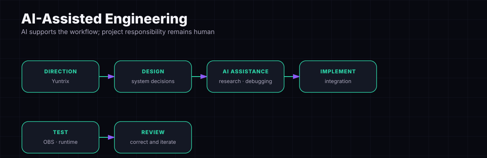

I use GPT and Google AI tools as development assistants for research, implementation, debugging and iteration. System direction, integration decisions, testing and project responsibility remain mine. Suggestions are reviewed and adapted before becoming part of the project.

## Technical direction

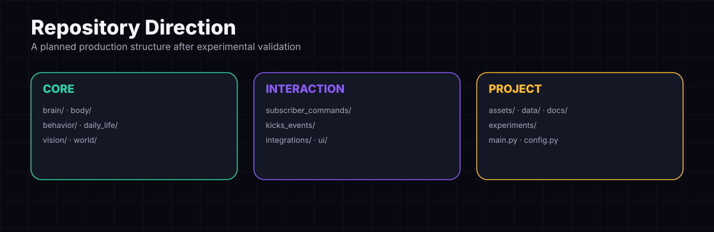

The repository currently preserves experimental versions for inspection. The final refactor will separate production modules from experiments after compatible pipelines have been validated.

<strong>Getting started and data</strong>

The current repository is an experimental source release. Neural simulations require compatible scientific data and a verified relationship between processed matrices and neuron tables. Setup instructions should be treated as provisional until the production entry point is validated.

<strong>Security and privacy</strong>

Do not commit API keys, OBS credentials or private stream configuration. Screen capture may include private desktop content; external perception services may receive captured content when explicitly enabled. Redact viewer and scene information from public reports.

<strong>Contribution</strong>

Focused reports should include the tested script/version, input data assumptions, reproduction steps, expected behavior and observed result. For behavior features, describe entry, ownership, interruption, cleanup and completion.

## About the builder

**CS student & game tester @ PJATK, Warsaw. Building AI, automation, autonomous systems, agri-tech, simulations & tools for streaming/OBS.**

MaleCNS / OBS Fly is my first public project and a place where I am learning to turn experiments into an understandable, testable system.

## Türkçe kısa özet
PJATK Varşova’da Bilgisayar Bilimi öğrencisiyim ve game testing yapıyorum. Otomasyon, yazılım geliştirme, yapay zekâ destekli tarım teknolojileri, akıllı sistemler ve yayıncılık araçları üzerine projeler geliştiriyorum.
. MaleCNS / OBS Fly, OBS içinde yaşayan; ihtiyaçlar, davranışlar ve ileride MaleCNS tabanlı duyusal refleksler kazanması planlanan sanal bir sinek projesidir. GPT ve Google AI araçlarından geliştirme desteği alıyor, sistem kararlarını ve test sürecini kendim yönetiyorum.
