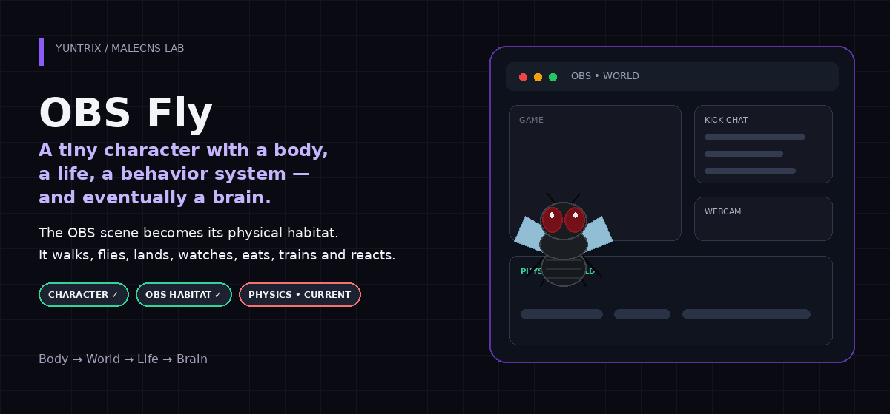
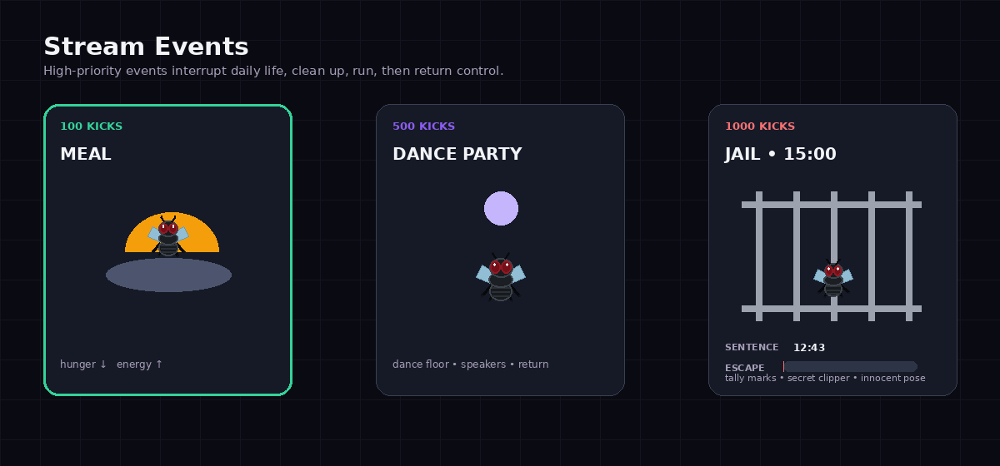

  

  <strong>CHARACTER · WORLD · LIFE · BRAIN · EVENTS · ROADMAP</strong>

  <a href="#01--what-is-this">01 What is this?</a> ·
  <a href="#02--meet-the-fly">02 Meet the Fly</a> ·
  <a href="#03--obs-is-the-habitat">03 OBS Habitat</a> ·
  <a href="#04--the-flys-daily-life">04 Daily Life</a> ·
  <a href="#05--life-dashboard">05 Life Dashboard</a> ·
  <a href="#06--how-a-behavior-happens">06 Behavior Flow</a> ·
  <a href="#07--brain--control-system">07 Brain</a> ·
  <a href="#08--stream-events">08 Events</a> ·
  <a href="#09--current-development">09 Current Development</a> ·
  <a href="#10--full-roadmap">10 Roadmap</a> ·
  <a href="#11--technical--contribution--security">11 Technical</a>

01 — WHAT IS THIS?

MaleCNS / OBS Fly is an experimental project built around one deliberately strange idea:

What if a tiny cartoon fly actually lived inside your OBS scene?

Not as a looping alert.
Not as a random GIF.
Not as a character that simply chooses an animation every few seconds.

The goal is a fly with a body, a physical habitat, internal needs, autonomous daily behavior, stream-event reactions, subscriber commands, and eventually a MaleCNS-inspired reflex/steering layer underneath its high-level life system.

Its world is the OBS scene itself.

The fly should eventually be able to:

walk → fly → land → collide → fall → recover → sit → watch → eat → sleep → exercise → clean → react → continue living

This is an experimental student project. It does not claim consciousness, a biologically validated complete fly brain, or a finished scientific simulation.

02 — MEET THE FLY

  

The current character is an original low-poly cartoon fly designed to remain readable at small stream-overlay sizes.

The exported fly_master.glb currently contains:

Character data

Current export

Animation clips

7

Animation channels per clip

81

Meshes

63

Nodes

96

Runtime format

GLB / glTF 2.0

Current animation clips

Clip

Duration

Purpose

FLY_IDLE

2.000 s

Ground idle

FLY_WALK

1.000 s

Ground locomotion

FLY_FLIGHT

0.333 s

Airborne loop

FLY_TAKEOFF

0.708 s

Ground → flight

FLY_LAND

0.792 s

Flight → ground

FLY_TURN_LEFT

0.708 s

Left turn

FLY_TURN_RIGHT

0.708 s

Right turn

The GLB is already loaded by the browser-facing OBS runtime.

03 — OBS IS THE HABITAT

  

The OBS scene is treated as a physical environment rather than a flat overlay.

The central rule is:

visual source ≠ collider ≠ support surface ≠ activity target

Examples:

Source

Collider

Support

Activity Target

Kick Chat

✓

✓

contextual

Webcam

✓

✓

✓

Mario

✓

✕

✕

Eventlist

✓

✕

✕

Combo

IGNORE

IGNORE

IGNORE

Current habitat work already includes:

WORLD scene used as the habitat

OBS sources participating in collision geometry

Combo fully ignored

Mario collision without support/activity role

Eventlist collision without support/activity role

Webcam remaining a usable support surface

Kick Chat geometry corrected

Kick Chat staying aligned during normal movement, manual movement and WATCHING

Physical collider logic being separated from activity/support semantics

A target sequence is:

walk across chat → reach edge → fall → take off → land on webcam → place chair → sit → watch

04 — THE FLY'S DAILY LIFE

  

The fly's daily life is intended to be state-driven, not a random animation playlist.

Planned daily behaviors include:

🪑 WATCHING — walk/fly to a valid surface, place a chair, sit and watch

🍗 EATING / SNACKING — reduce hunger and recover energy

😴 RESTING / SLEEPING — reduce fatigue and recover energy

🏃 CARDIO — treadmill exercise with energy/fatigue cost

💪 PUSHUPS / SITUPS — exercise with low-energy rejection

🧹 SWEEPING — ambient daily-life behavior

🧼 GROOMING

🔎 EXPLORING

The point is not just animation variety.
The point is for behavior to emerge from needs, context, cooldowns, cost, benefit and the physical world.

05 — LIFE DASHBOARD

  

The planned internal state includes:

State

Role

energy

walking, flying and exercise consume it; food/rest recover it

hunger / satiety

changes over time; eating restores satiety

fatigue / sleep_pressure

activity increases it; sleep/rest reduce it

mood

presentation-level emotional state for the character UI

strength / conditioning

training can gradually improve physical capacity

stress / arousal

reactions and sensory pressure can modulate it

boredom / activity_need

inactivity can make exploration/activity more attractive

The dashboard values shown above are illustrative UI values, not measured runtime output.

Recovery and progression

FOOD      → hunger ↓ / energy ↑
SLEEP     → fatigue ↓ / energy ↑
TRAINING  → energy ↓ / fatigue ↑ / conditioning ↑
INACTIVITY→ boredom ↑

The strength / conditioning state is intended to give the fly a small long-term development arc instead of resetting to exactly the same physical state forever.

06 — HOW A BEHAVIOR HAPPENS

  

A simple autonomous example:

BORED
  ↓
EXPLORE
  ↓
WALK
  ↓
EDGE
  ↓
FALL
  ↓
TAKEOFF
  ↓
WEBCAM
  ↓
LAND
  ↓
WATCH

Now a higher-priority event arrives:

500 KICKS
    ↓
PRIORITY 300
    ↓
CANCEL_REQUESTED
    ↓
CLEANUP
    ↓
DANCE_PARTY
    ↓
DONE
    ↓
RETURN TO AUTONOMOUS LIFE

This is why behaviors need explicit lifecycle phases and cleanup instead of instant hard-switching.

07 — BRAIN / CONTROL SYSTEM

  

The architecture separates high-level life decisions from low-level body modulation.

LIFE — what is the fly doing?

Life State
    ↓
Life Manager
    ↓
Behavior Arbiter
    ↓
Current Behavior
    ↓
Body

MALECNS — how does the body react while doing it?

Vision / sensory signals
        ↓
MaleCNS reflex layer
        ↓
Steering / Avoidance / Startle / Looming
        ↓
Body modulation

The core design principle is:

Life decides WHAT the fly is doing. MaleCNS eventually influences HOW its body reacts while doing it.

MaleCNS is therefore not intended to own every high-level daily-life decision.

08 — STREAM EVENTS

  

Planned Kicks routing:

Kicks

Event

100

MEAL

500

DANCE_PARTY + existing meme/video

1000

JAIL — 15 minutes

Jail concept

The jail event is intentionally ridiculous, but the internal behavior still follows the same life/state architecture.

Planned jail features:

jail asset

enter transition

idle

sit

sleep

tally marks

secret escape attempts

nail clipper

energy-based escape rate

escape energy cost

!kaçmaya çalışıyor

hidden tool

innocent pose

escape progress reset

sentence reset → 15 minutes

Subscriber commands

Planned subscriber command layer:

subscriber verification

command whitelist

cooldowns

!cardio

!pushup

!situp

reject when energy is insufficient

COMMAND_REJECTED_LOW_ENERGY

rejection shown in Brain / State UI

09 — CURRENT DEVELOPMENT

  

CHARACTER ✅
    ↓
HABITAT ✅
    ↓
PHYSICS 🔴
    ↓
WATCHING 🟠
    ↓
LIFE
    ↓
MALECNS

Current phase: Final Physics Calibration

The current goal is to stop relying on placeholder body dimensions and make physics match the real exported GLB character.

final body collider for the real GLB

real landing point

physical foot contact point

walking footprint

standing footprint

flying collider

overlay-edge snag testing

left/right collision testing

landing on overlays

collision from below

walking off an overlay and falling

SCREEN_FLOOR

ground ↔ flight transitions

10 — FULL ROADMAP

Status legend: ✅ implemented foundation · 🔴 current · 🟠 next · 🟡 planned · ⚪ later / integration

<strong>✅ A. Character / Blender</strong>

Original low-poly cartoon fly designed

Rig created

Core animations exported:

FLY_IDLE

FLY_WALK

FLY_FLIGHT

FLY_TAKEOFF

FLY_LAND

FLY_TURN_LEFT

FLY_TURN_RIGHT

fly_master.blend kept as the master Blender file

fly_master.glb exported

GLB connected to the OBS Browser Source runtime

GLB animation clips run in the runtime

Character scale corrected

Grounding / physical placement corrected

<strong>✅ B. OBS Habitat — Base Geometry</strong>

WORLD scene used as the habitat

OBS sources enter the collision system

Combo source fully ignored

Mario collision exists but activity/support is disabled

Eventlist collision exists but activity/support is disabled

Webcam remains a usable support surface

Kick Chat geometry bug fixed

Kick Chat positioned correctly during normal movement

Kick Chat positioned correctly during manual movement

Kick Chat positioned correctly during WATCHING

Physical collider and activity/support concepts are being separated

<strong>🔴 C. CURRENT — Final Physics Calibration</strong>

Final body collider for the real GLB character

Real landing point

Physical foot-contact point

Walking footprint

Standing footprint

Flying collider

Overlay-edge snag test

Left/right collision test

Landing on top of overlays

Collision from below overlays

Walk-off-and-fall test

SCREEN_FLOOR behavior test

Ground ↔ flight transition test

The goal of this phase is to completely retire placeholder body dimensions and make all movement use the real character scale.

<strong>🟠 D. WATCHING Finalization</strong>

Real chair asset

Scale chair to the character

Walk/fly toward chair target

Chair sitting point

Chair placement on webcam

Chair placement on chat

Reject surfaces that are too small

Avoid repeatedly placing the chair in the same location

Natural weighted placement

FLY_SIT_DOWN

FLY_SIT_IDLE

FLY_STAND_UP

FLY_WATCHING_IDLE

<strong>🟡 E. Life State System</strong>

energy

hunger / satiety

fatigue / sleep_pressure

strength / conditioning

stress / arousal

boredom / activity_need

state changes over time

walking energy cost

flying energy cost

exercise energy/fatigue cost

sleep recovery

food recovery

critical-energy behaviors

<strong>🟢 F. Life Manager / Autonomous Life</strong>

RESTING

EXPLORING

WATCHING

SLEEPING

EATING / SNACKING

GROOMING

SWEEPING

PUSHUPS

SITUPS

state-driven selection instead of pure randomness

cooldown system

preconditions

cost / benefit

behavior transition system

<strong>🔵 G. Behavior Arbiter</strong>

Priority:

KICKS EVENTS        = 300
SUBSCRIBER COMMANDS = 200
DAILY LIFE          = 100

Behavior lifecycle:

ENTER

ACTIVE

CANCEL_REQUESTED

TRANSITION_OUT

CLEANUP

DONE

graceful preemption

current behavior tracking

pending behavior tracking

context commands routed separately

<strong>🟣 H. Subscriber Commands</strong>

Subscriber verification

Command whitelist

Cooldowns

!cardio

!pushup

!situp

Reject command when energy is insufficient

COMMAND_REJECTED_LOW_ENERGY

Show rejection in Brain / State UI

<strong>🟪 I. Kicks Events</strong>

Event router

Kicks router

Preserve the existing meme/video system

100 Kicks → MEAL

500 Kicks → DANCE_PARTY + existing meme/video

1000 Kicks → JAIL for 15 minutes

Jail

Jail asset

Jail enter

Idle

Sit

Sleep

Tally marks

Secret escape

Nail clipper

Energy-based escape rate

Escape energy cost

!kaçmaya çalışıyor

Hide tool

Innocent pose

Escape progress reset

Sentence reset → 15 min

Dance

Dance floor

Speakers

Disco ball

Dance animation set

Event duration

Return to previous life afterward

<strong>🟤 J. Props / Assets</strong>

Chair

Popcorn

Table

Table cloth

Food

Blanket

Lamp

Broom

Treadmill

Jail

Nail clipper

Dance floor

Speakers

Disco ball

<strong>⚫ K. MaleCNS Integration</strong>

This is intentionally connected after the life system.

High-level behavior ≠ MaleCNS

MaleCNS steering

Avoidance

Startle

Looming response

Locomotor variation

Arousal modulation

Short reflexes while a behavior continues

Energy/strength → actuator-capacity model

Controlled internal signals

<strong>⚪ L. Vision</strong>

Local motion

Motion left/right

Looming

Brightness flash

Large scene change

Temporal filtering

Hysteresis

Cooldown

Less-frequent semantic vision

Vision should not directly choose high-level behavior

<strong>🧠 M. Brain / Life Dashboard</strong>

Current behavior

Behavior phase

Energy

Hunger

Fatigue

Strength

Stress/arousal

Boredom

Current animation

Current support surface

Collision state

MaleCNS motor output

Recent sensory event

Subscriber/Kicks event log

<strong>🧹 N. Final Refactor</strong>

Target production layout:

main.py
config.py
brain/
body/
behavior/
daily_life/
subscriber_commands/
kicks_events/
integrations/
world/
ui/
assets/
experiments/

Then:

move old experiments under experiments/

keep one production entry point

clean config/constants

clean logging

11 — TECHNICAL / CONTRIBUTION / SECURITY

Repository map

MaleCNS-Lab/
├── body/
├── world/
├── vision/
├── data/
├── docs/
├── assets/vendor/
├── fly_master.glb
├── lif_engine*.py
├── brain_session*.py
├── motor_decoder*.py
├── vision_bridge*.py
├── visual_retina_encoder*.py
└── obs_overlay_server*.py

Security / privacy

The public repository should contain configuration names, never credential values.

Keep these out of Git:

API keys

OBS passwords

tokens

private screenshots

raw personal logs

local .env files

private-key files

generated vision reports

The current .gitignore already excludes common credential files, logs, screenshots and generated scientific data.

Getting started

python -m venv .venv
.venv\Scripts\python.exe -m pip install -r requirements.txt

This is still an experimental source release rather than a one-command end-user application.

See:

data/README.md

CONTRIBUTING.md

Contribution areas

Useful areas include:

physics / collision architecture

behavior arbitration and graceful preemption

OBS WebSocket geometry handling

Three.js / GLB runtime behavior

animation transitions

life-state architecture

connectome-to-motor experiments

visual laterality

profiling and reproducibility

  <strong>Built by <a href="https://github.com/Yuntrix">Yuntrix</a></strong>

