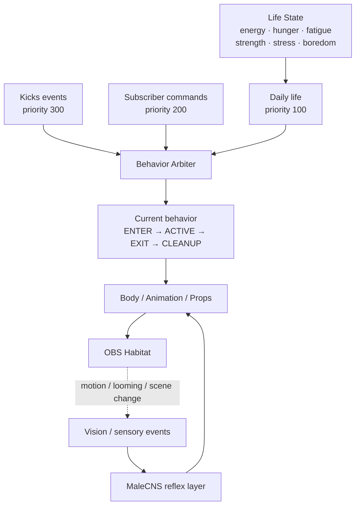
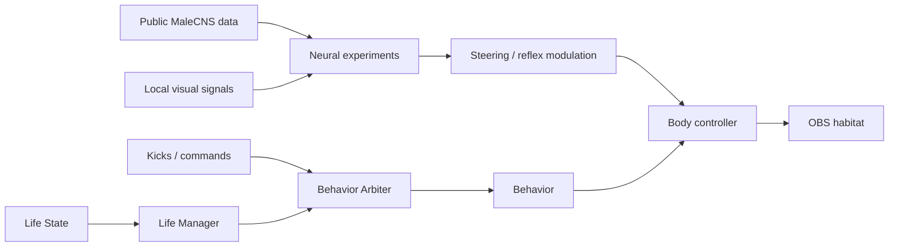

<p align="center">
  
</p>

<p align="center">
  <strong>A tiny autonomous cartoon fly that treats an OBS scene as a physical world.</strong><br>
  Rigged 3D character · browser runtime · OBS habitat · life-state system · connectome experiments
</p>

<p align="center">
  <a href="#-what-is-this">What is this?</a> ·
  <a href="#-the-character-is-already-alive-on-screen">Character</a> ·
  <a href="#-obs-is-the-habitat">OBS habitat</a> ·
  <a href="#-where-development-is-right-now">Current phase</a> ·
  <a href="#-full-roadmap">Roadmap</a> ·
  <a href="#-getting-started">Getting started</a> ·
  <a href="CONTRIBUTING.md">Contribute</a>
</p>

---

## 🪰 What is this?

**MaleCNS / OBS Fly** is an experimental student project built around one slightly ridiculous idea:

> What if a tiny cartoon fly actually *lived* inside your OBS scene?

Not as a looping GIF. Not as a random alert animation.

The goal is a character that can **walk, fly, land, collide with overlays, use surfaces, watch the stream, get tired, get hungry, exercise, eat, sleep, react to stream events and eventually layer MaleCNS-inspired reflexes underneath its higher-level behavior.**

OBS is not just the place where the fly is rendered — **the scene itself becomes its habitat.** Webcam boxes, chat overlays and other sources can become geometry the fly can land on, walk across, fall from or ignore depending on the source rules.

This repository also contains the earlier neural, vision and motor-control experiments that motivated the project. Those experiments are still exploratory; the current product-facing work is focused on turning the fly into a stable autonomous character first, then integrating the MaleCNS layer cleanly afterward.

> **Important:** this is not a claim of consciousness, biological validation or a complete brain simulation. It is an independent learning project exploring connectome-inspired control, real-time embodiment and interactive behavior.

---

## ✨ The character is already alive on screen

The fly is an original **low-poly, cute, cartoon 3D character** built for small-screen readability inside a stream overlay.

The exported `fly_master.glb` currently contains:

| Character data | Verified in GLB |
| :--- | ---: |
| Animation clips | **7** |
| Animation channels per clip | **81** |
| Meshes | **63** |
| Nodes | **96** |
| Runtime format | **GLB / glTF 2.0** |

<p align="center">
  
</p>

### Current animation clips

| Clip | Duration | Use |
| :--- | ---: | :--- |
| `FLY_IDLE` | 2.000 s | Ground idle loop |
| `FLY_WALK` | 1.000 s | Ground locomotion |
| `FLY_FLIGHT` | 0.333 s | Airborne loop |
| `FLY_TAKEOFF` | 0.708 s | Ground → flight transition |
| `FLY_LAND` | 0.792 s | Flight → ground transition |
| `FLY_TURN_LEFT` | 0.708 s | Left turn transition |
| `FLY_TURN_RIGHT` | 0.708 s | Right turn transition |

The GLB is already loaded by the browser runtime and the animation clips play in the OBS-facing environment. Character scale and grounding were also corrected after replacing the old placeholder body with the real model.

➡️ [`fly_master.glb`](fly_master.glb)

---

## 🎬 OBS is the habitat

The `WORLD` scene is treated as a physical environment rather than a flat overlay.

The system is moving toward a simple rule: **visual source ≠ physical support ≠ activity target.** A source can collide with the fly without being a valid place to stand, sit or perform an activity.

### Already working

- OBS sources can participate in the collision world.
- The combo source is fully ignored.
- Mario has collision geometry but is not treated as an activity/support surface.
- Eventlist has collision geometry but is not treated as an activity/support surface.
- Webcam can remain a usable support surface.
- Kick Chat geometry placement was corrected.
- Kick Chat stays aligned during normal movement, manual movement and `WATCHING`.
- Physical collider logic is being separated from activity/support semantics.
- The real GLB character is running inside the browser runtime.

The end goal is that the fly can do things like:

**walk across chat → reach the edge → fall → take off → land on webcam → pull up a chair → watch the stream.**

---

## 🍿 It should have a life, not a playlist

The long-term behavior system is intentionally not “pick a random animation every few seconds.”

The fly will have internal needs and a small autonomous life: energy, hunger, fatigue, strength, stress/arousal and boredom/activity need. Those states will influence what it chooses to do and whether it can afford to do it.

<p align="center">
  
</p>

Planned examples include:

- 🪑 **WATCHING** — move to a valid surface, place a chair, sit and watch.
- 🍗 **EATING / MEAL** — recover hunger/energy through food.
- 🏃 **CARDIO** — treadmill exercise with energy and fatigue cost.
- 💪 **PUSHUPS / SITUPS** — commandable exercise, rejected when energy is too low.
- 🧹 **SWEEPING** — ambient daily-life behavior.
- 😴 **SLEEPING / RESTING** — recovery driven by fatigue and energy state.
- 💃 **DANCE PARTY** — stream-event behavior with temporary props and animation set.
- 🚔 **JAIL** — 1000 Kicks can trigger a 15-minute sentence, including secret escape attempts.

The absurd parts are intentional. The underlying behavior system still has to be deterministic enough to debug, interruptible enough to react to stream events and structured enough to support future MaleCNS reflexes.

---

## 🚧 Where development is right now

### **Current phase: Final Physics Calibration**

The next milestone is to stop relying on placeholder body dimensions and make the physics match the **real exported fly**.

```text
Character ✅  →  OBS Habitat ✅  →  Physics Calibration 🔴
                                      ↓
                                 WATCHING 🟠
                                      ↓
                                  Life State 🟡
                                      ↓
                               Autonomous Life
                                      ↓
                           Commands / Kicks Events
                                      ↓
                              MaleCNS + Vision
```

### Physics calibration checklist

- Final body collider for the real GLB character
- Real landing point
- Physical foot contact point
- Walking footprint
- Standing footprint
- Flying collider
- Overlay-edge snag testing
- Left/right collision testing
- Landing on top of overlays
- Hitting overlays from below
- Walking off an overlay and falling
- `SCREEN_FLOOR` behavior
- Ground ↔ flight transition testing

This phase matters because every later system — chairs, exercise props, jail, walking, landing and life behaviors — depends on the fly understanding where its body really is.

---

## 🧠 Behavior architecture

High-level behavior and low-level reflex control are deliberately separated.



### Arbiter priority

```text
KICKS EVENTS        = 300
SUBSCRIBER COMMANDS = 200
DAILY LIFE          = 100
```

A stream event should be able to interrupt daily life without leaving a chair, jail prop, treadmill or animation state stuck on screen. That is why behaviors are planned around explicit phases such as `ENTER`, `ACTIVE`, `CANCEL_REQUESTED`, `TRANSITION_OUT`, `CLEANUP` and `DONE`.

MaleCNS is planned as a **steering/reflex layer**, not as the owner of every high-level life decision. The fly can continue a behavior while short reflexes such as avoidance, looming response or startle temporarily alter locomotion.

---

## 🗺️ Full roadmap

Status legend: **✅ implemented foundation** · **🔴 current** · **🟠 next** · **🟡 planned life system** · **⚪ later / integration**

<details open>
<summary><strong>✅ A. Character / Blender</strong></summary>

- Original low-poly cartoon fly designed
- Rig created
- Core animations exported:
  - `FLY_IDLE`
  - `FLY_WALK`
  - `FLY_FLIGHT`
  - `FLY_TAKEOFF`
  - `FLY_LAND`
  - `FLY_TURN_LEFT`
  - `FLY_TURN_RIGHT`
- `fly_master.blend` kept as the master Blender file locally
- `fly_master.glb` exported
- GLB connected to the OBS Browser Source runtime
- GLB animation clips run in the runtime
- Character scale corrected
- Grounding / physical placement corrected

</details>

<details open>
<summary><strong>✅ B. OBS Habitat — Base Geometry</strong></summary>

- `WORLD` scene used as the habitat
- OBS sources enter the collision system
- Combo source fully ignored
- Mario collision exists but activity/support is disabled
- Eventlist collision exists but activity/support is disabled
- Webcam remains a usable support surface
- Kick Chat geometry bug fixed
- Kick Chat positioned correctly during normal movement
- Kick Chat positioned correctly during manual movement
- Kick Chat positioned correctly during `WATCHING`
- Physical collider and activity/support concepts are being separated

</details>

<details open>
<summary><strong>🔴 C. CURRENT — Final Physics Calibration</strong></summary>

- Final body collider for the real GLB character
- Real landing point
- Physical foot-contact point
- Walking footprint
- Standing footprint
- Flying collider
- Overlay-edge snag test
- Left/right collision test
- Landing on top of overlays
- Collision from below overlays
- Walk-off-and-fall test
- `SCREEN_FLOOR` behavior test
- Ground ↔ flight transition test

The goal of this phase is to completely retire placeholder body dimensions and make all movement use the real character scale.

</details>

<details>
<summary><strong>🟠 D. WATCHING Finalization</strong></summary>

- Real chair asset
- Scale chair to the character
- Walk/fly toward chair target
- Chair sitting point
- Chair placement on webcam
- Chair placement on chat
- Reject surfaces that are too small
- Avoid repeatedly placing the chair in the same location
- Natural weighted placement
- `FLY_SIT_DOWN`
- `FLY_SIT_IDLE`
- `FLY_STAND_UP`
- `FLY_WATCHING_IDLE`

</details>

<details>
<summary><strong>🟡 E. Life State System</strong></summary>

- `energy`
- `hunger / satiety`
- `fatigue / sleep_pressure`
- `strength / conditioning`
- `stress / arousal`
- `boredom / activity_need`
- State changes over time
- Walking energy cost
- Flying energy cost
- Exercise energy/fatigue cost
- Sleep recovery
- Food recovery
- Critical-energy behaviors

</details>

<details>
<summary><strong>🟢 F. Life Manager / Autonomous Life</strong></summary>

- `RESTING`
- `EXPLORING`
- `WATCHING`
- `SLEEPING`
- `EATING / SNACKING`
- `GROOMING`
- `SWEEPING`
- `PUSHUPS`
- `SITUPS`
- State-driven selection instead of pure randomness
- Cooldown system
- Preconditions
- Cost / benefit
- Behavior transition system

</details>

<details>
<summary><strong>🔵 G. Behavior Arbiter</strong></summary>

Priority:

```text
KICKS EVENTS        = 300
SUBSCRIBER COMMANDS = 200
DAILY LIFE          = 100
```

Behavior lifecycle:

- `ENTER`
- `ACTIVE`
- `CANCEL_REQUESTED`
- `TRANSITION_OUT`
- `CLEANUP`
- `DONE`
- Graceful preemption
- Current behavior tracking
- Pending behavior tracking
- Context commands routed separately

</details>

<details>
<summary><strong>🟣 H. Subscriber Commands</strong></summary>

- Subscriber verification
- Command whitelist
- Cooldowns
- `!cardio`
- `!pushup`
- `!situp`
- Reject command when energy is insufficient
- `COMMAND_REJECTED_LOW_ENERGY`
- Show rejection in Brain / State UI

</details>

<details>
<summary><strong>🟪 I. Kicks Events</strong></summary>

### Event router

- Kicks router
- Preserve the existing meme/video system
- **100 Kicks → MEAL**
- **500 Kicks → DANCE_PARTY + existing meme/video**
- **1000 Kicks → JAIL for 15 minutes**

### Jail

- Jail asset
- Jail enter
- Idle
- Sit
- Sleep
- Tally marks
- Secret escape
- Nail clipper
- Energy-based escape rate
- Escape energy cost
- `!kaçmaya çalışıyor`
- Hide tool
- Innocent pose
- Escape progress reset
- Sentence reset → 15 min

### Dance

- Dance floor
- Speakers
- Disco ball
- Dance animation set
- Event duration
- Return to previous life afterward

</details>

<details>
<summary><strong>🟤 J. Props / Assets</strong></summary>

- Chair
- Popcorn
- Table
- Table cloth
- Food
- Blanket
- Lamp
- Broom
- Treadmill
- Jail
- Nail clipper
- Dance floor
- Speakers
- Disco ball

</details>

<details>
<summary><strong>⚫ K. MaleCNS Integration</strong></summary>

This is intentionally connected **after the life system**.

- High-level behavior ≠ MaleCNS
- MaleCNS steering
- Avoidance
- Startle
- Looming response
- Locomotor variation
- Arousal modulation
- Short reflexes while a behavior continues
- Energy/strength → actuator-capacity model
- Controlled internal signals

</details>

<details>
<summary><strong>⚪ L. Vision</strong></summary>

- Local motion
- Motion left/right
- Looming
- Brightness flash
- Large scene change
- Temporal filtering
- Hysteresis
- Cooldown
- Less-frequent semantic vision
- Vision should not directly choose high-level behavior

</details>

<details>
<summary><strong>🧠 M. Brain / Life Dashboard</strong></summary>

- Current behavior
- Behavior phase
- Energy
- Hunger
- Fatigue
- Strength
- Stress/arousal
- Boredom
- Current animation
- Current support surface
- Collision state
- MaleCNS motor output
- Recent sensory event
- Subscriber/Kicks event log

</details>

<details>
<summary><strong>🧹 N. Final Refactor</strong></summary>

Target production layout:

```text
main.py
config.py
brain/
body/
behavior/
daily_life/
subscriber_commands/
kicks_events/
integrations/
world/
ui/
assets/
experiments/
```

Then:

- Move old experiments under `experiments/`
- Keep one production entry point
- Clean config/constants
- Clean logging

</details>

---

## 🔬 Where MaleCNS fits

The repository began as an exploration of how public MaleCNS connectome data could participate in an understandable virtual-fly simulation.

Existing research code includes:

- Leaky integrate-and-fire neural engines
- Continuous and multi-input brain sessions
- Visual retina / laterality experiments
- Screen-capture and visual encoding experiments
- Motor decoding / steering experiments
- Optional Gemini screen-perception experiments
- Browser / OBS embodiment prototypes

The current architecture direction is stricter than the early experiments: **the character should first have a stable body, world and behavior lifecycle.** MaleCNS can then modulate movement and reflexes without being forced to solve high-level daily-life planning.



The underlying [MaleCNS connectome](https://male-cns.janelia.org/) is a collaboration between FlyEM at HHMI Janelia, the University of Cambridge, the MRC Laboratory of Molecular Biology and Google Research. Their work supplies the anatomical dataset; this repository is an independent student experiment built around it.

---

## 🗂️ Repository map

The repository still contains many versioned experiments. A final cleanup is deliberately postponed until the behavior architecture stabilizes.

```text
MaleCNS-Lab/
├── body/                         # Character state/control prototypes
├── world/                        # OBS habitat and placement logic
├── vision/                       # Optional perception experiments
├── data/                         # Scientific-data setup and inventory
├── docs/                         # Roadmaps and project documentation
├── assets/vendor/                # Browser renderer bundle
├── fly_master.glb                # Rigged cartoon fly + 7 animations
├── lif_engine*.py                # Neural simulation experiments
├── brain_session*.py             # Brain/session experiments
├── motor_decoder*.py             # Neural → motor experiments
├── vision_bridge*.py             # Screen → input experiments
├── visual_retina_encoder*.py     # Retina mapping experiments
├── obs_overlay_server*.py        # OBS/browser runtime generations
└── watching_prototype.py         # WATCHING behavior prototype
```

Version suffixes do **not** guarantee compatibility. Several `test_*.py` files are experimental scripts with top-level execution rather than a conventional unit-test suite.

---

## 🚀 Getting started

> The repository is still an experimental source release. The complete neural path requires additional scientific data and the current runtime has not yet been packaged as a one-command end-user application.

Python 3.12 reflects the original development environment.

```powershell
python -m venv .venv
.venv\Scripts\python.exe -m pip install -r requirements.txt

# After supplying the matching scientific data:
.venv\Scripts\python.exe obs_overlay_server_v6.py
```

The overlay is configured around `http://127.0.0.1:8765/` and OBS integration expects an OBS WebSocket setup.

For the scientific-data side, start with [`data/README.md`](data/README.md).

### Environment variables

Optional integrations read credentials such as:

```text
GEMINI_API_KEY
OBS_WEBSOCKET_PASSWORD
```

Do not commit real credentials. Screen capture may contain private desktop content; any external vision integration should be treated accordingly.

---

## 🧪 Project boundaries

- This is a work in progress.
- The anatomy dataset does not automatically imply validated neural dynamics or validated behavior.
- Experimental source files are not all part of one stable production pipeline yet.
- Planned life behaviors shown above are roadmap targets unless explicitly marked implemented/prototype.
- MaleCNS is not currently presented as the sole controller of the character's complete autonomous life.
- Performance, latency and biological claims require measurements and reproducible validation before they should be treated as results.

---

## 🤝 Help shape it

This is my first public project and I am building it while learning. I use GPT-assisted coding and debugging, then inspect, test and refine the implementation as the project evolves.

Useful contribution areas include:

- Physics/collision architecture
- Behavior arbitration and preemption
- OBS WebSocket geometry handling
- Three.js / GLB runtime behavior
- Animation state transitions
- Connectome-to-motor experiments
- Visual encoding / laterality validation
- Profiling and reproducibility

See [`CONTRIBUTING.md`](CONTRIBUTING.md) for contribution notes.

---

## 🇹🇷 Türkçe kısa açıklama

MaleCNS / OBS Fly, OBS ekranının içinde yaşayan küçük bir çizgi-film karasineği oluşturma projesi. Amaç sadece animasyon oynatan bir overlay yapmak değil; sineğin OBS kaynaklarını fiziksel bir dünya gibi algılaması, yürümesi, uçması, yüzeylere konması, günlük ihtiyaçlara göre davranış seçmesi, yayın eventlerine tepki vermesi ve ileride MaleCNS tabanlı refleks/steering katmanıyla birleşmesi.

Şu an karakter, rig, GLB runtime ve temel OBS habitat sistemi mevcut. Aktif geliştirme aşaması gerçek karakter ölçülerine göre **final fizik kalibrasyonu**.

---

<p align="center">
  <strong>Built by <a href="https://github.com/Yuntrix">Yuntrix</a></strong><br>
  CS student · PJATK, Warsaw · learning in public
</p>
