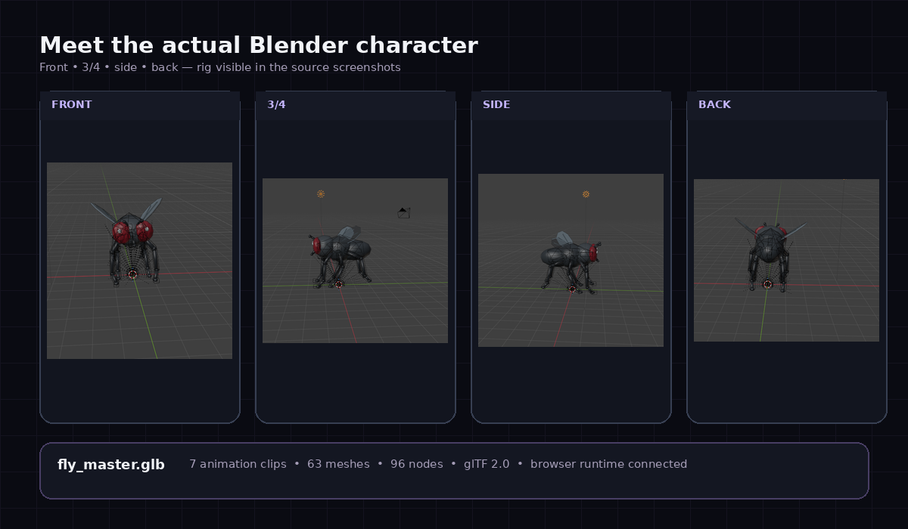
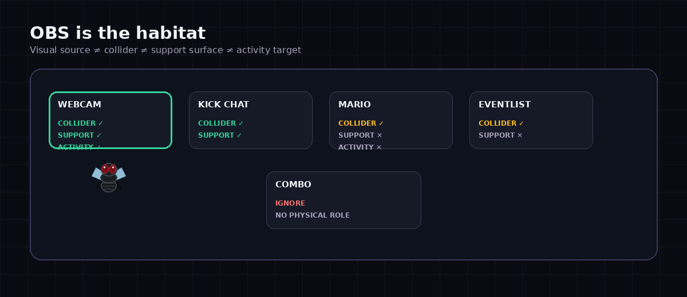
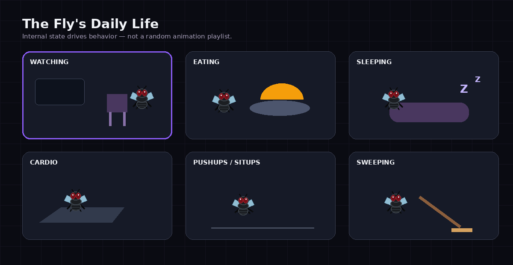
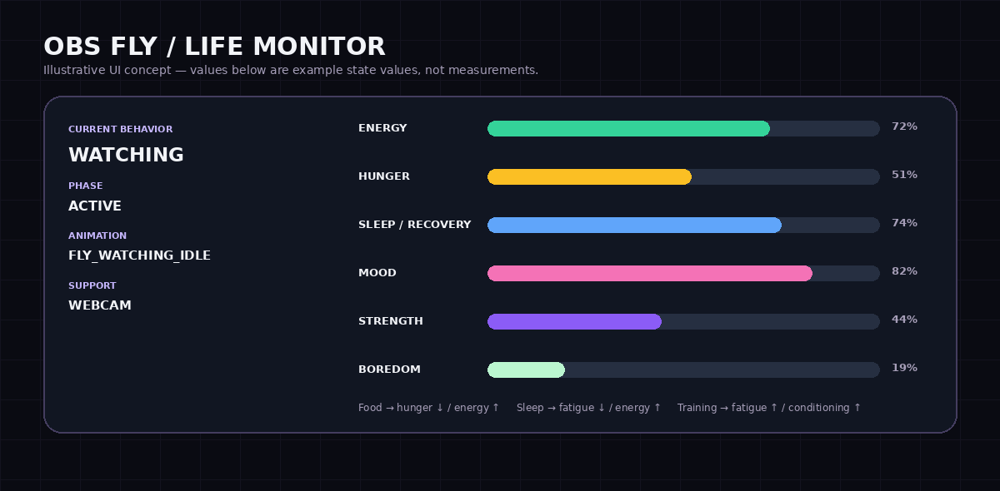
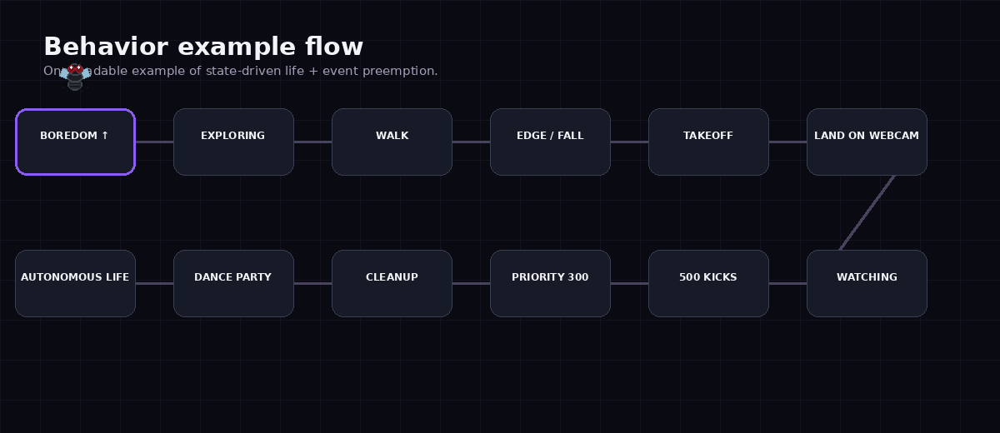
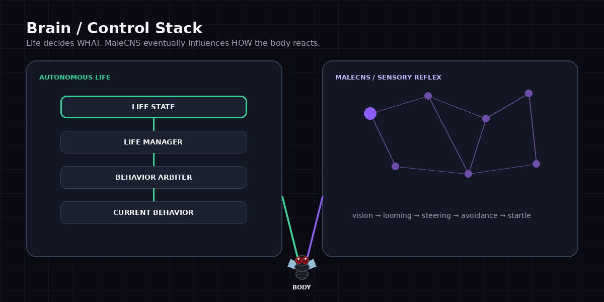
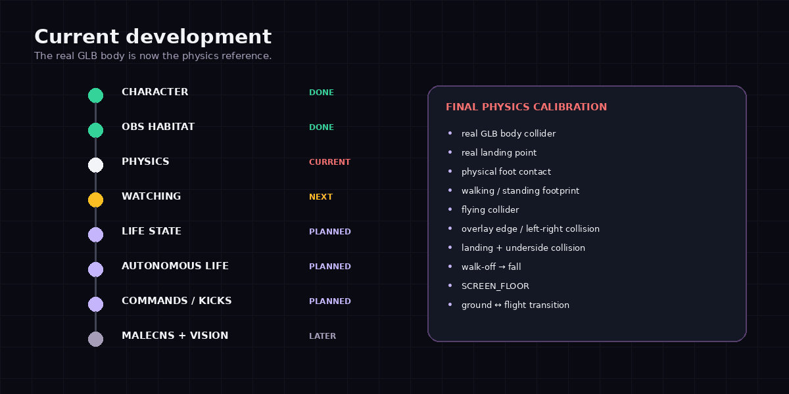

<p align="center">
  
</p>

<h1 align="center">MaleCNS / OBS Fly</h1>

<p align="center">
  <strong>A tiny OBS fly with a body, a life, a behavior system — and eventually a brain.</strong>
</p>

<p align="center">
  <a href="#character">CHARACTER</a> ·
  <a href="#world">WORLD</a> ·
  <a href="#life">LIFE</a> ·
  <a href="#brain">BRAIN</a> ·
  <a href="#events">EVENTS</a> ·
  <a href="#roadmap">ROADMAP</a>
</p>

<p align="center">Character ✅ · OBS Habitat ✅ · Physics Calibration 🔴</p>

---

## 01 — What is this?

**OBS Fly turns an OBS scene into a small character's physical habitat.** Webcam frames, chat panels and selected overlays become places to collide with, land on and live around.

The project grows from a Blender character into a physical body, then an autonomous life system, and eventually a MaleCNS sensory and reflex layer. The goal is a fly that walks, flies, watches the stream, eats, rests, trains and reacts to viewers through a coherent behavior system.

**Body → World → Life → Brain**

The character and habitat foundations are complete; physics calibration is the current milestone. Daily life, stream events and brain integration below describe the intended system. The animated diagrams illustrate that design; the character showcase shows the actual Blender model.

<a id="character"></a>

## 02 — Meet the Fly



Big red eyes, a compact black-and-grey body, proportioned wings and mechanical, low-poly legs: this is the character at the center of the project.

| Model | Details |
| --- | --- |
| Asset | `fly_master.glb` |
| Format | GLB / glTF 2.0 |
| Animation clips | 7 |
| Meshes | 63 |
| Nodes | 96 |
| Integration | Browser runtime connected |

**Existing clips:** `IDLE` · `WALK` · `FLIGHT` · `TAKEOFF` · `LAND` · `TURN LEFT` · `TURN RIGHT`

The real GLB body is the reference for the current physics work, including foot contact, landing alignment and collision bounds.

<a id="world"></a>

## 03 — OBS is the habitat



**Visual source ≠ Collider ≠ Support surface ≠ Activity target**

A visible source does not automatically become a place to stand. Collision, support and activity roles are assigned separately.

| Source | Collider | Support surface | Activity role |
| --- | :---: | :---: | --- |
| Webcam | ✓ | ✓ | Watching target |
| Kick Chat | ✓ | ✓ | Defined per behavior |
| Mario | ✓ | ✕ | None |
| Eventlist | ✓ | ✕ | None |
| Combo | Ignored | ✕ | No physical role |

<a id="life"></a>

## 04 — The Fly's daily life



Internal state drives the planned daily routine. Hunger makes food attractive; fatigue creates a reason to rest; boredom encourages exploration.

| Activity | Life in the scene |
| --- | --- |
| **Watching** | Set up a chair on a suitable support and watch the stream. |
| **Eating** | Use a meal prop to reduce hunger and recover energy. |
| **Sleeping** | Settle into a sleeping area to recover. |
| **Cardio** | Train on a treadmill, spending energy to build conditioning. |
| **Pushups / Situps** | Exercise through a dedicated activity sequence. |
| **Sweeping** | Pick up a broom and perform a small cleaning routine. |
| **Grooming** | Add self-care to the everyday routine. |
| **Exploring** | Move through the habitat as boredom rises. |

## 05 — Life dashboard



The planned monitor connects visible behavior to internal state: **current behavior**, **phase**, **animation** and **support**, alongside energy, hunger, sleep/recovery, mood, strength and boredom.

*The displayed values are illustrative, not live measurements. `FLY_WATCHING_IDLE` is a planned behavior animation label, separate from the seven existing clips.*

| Input | Intended effect |
| --- | --- |
| Food | Hunger ↓ · Energy ↑ |
| Sleep | Fatigue ↓ · Energy ↑ |
| Exercise | Energy ↓ · Fatigue ↑ · Conditioning ↑ |
| Extended inactivity | Boredom ↑ |

## 06 — How a behavior happens



A planned sequence makes the control system concrete:

1. **Boredom rises.** The Life Manager considers `EXPLORING`.
2. **The Behavior Arbiter accepts daily life at priority 100.** The behavior enters its `ENTER` phase and the fly begins walking.
3. **The fly reaches an edge.** Walking off a support leads to a fall, then `TAKEOFF`.
4. **A webcam support becomes the destination.** The fly approaches and plays `LAND`.
5. **Watching becomes attractive.** A chair is placed and `WATCHING` becomes `ACTIVE`.
6. **500 Kicks arrives at priority 300.** Watching receives `CANCEL_REQUESTED` and cleans up its chair.
7. **`DANCE_PARTY` takes control.** When the event reaches `DONE`, control returns to autonomous life.

Behavior changes include entry, cancellation and cleanup so props and body control remain consistent when an event interrupts the routine.

<a id="brain"></a>

## 07 — Brain / control system



**Life decides WHAT the fly is doing. MaleCNS will influence HOW its body reacts while doing it.**

| Layer | Planned control path | Responsibility |
| --- | --- | --- |
| Autonomous life | Life State → Life Manager → Behavior Arbiter → Behavior → Body | Choose and manage activities. |
| Sensory / reflex | Vision → MaleCNS → Reflex / Steering → Body modulation | Influence avoidance, startle and responses to approaching stimuli. |

The life system provides intent. The later sensory layer adds reactions while the body carries out that intent.

<a id="events"></a>

## 08 — Stream events


Viewer events are planned as higher-priority behaviors: interrupt daily life, clean up the current activity, run the event, then return control.

| Kicks | Event | Planned experience |
| ---: | --- | --- |
| **100** | **Meal** | A food interaction that reduces hunger and restores energy. |
| **500** | **Dance party** | A dance floor, speakers and a temporary party routine. |
| **1000** | **Jail — 15:00** | A timed sentence with its own routine and escape mechanics. |

**Life behind bars:** sit, idle, sleep and mark the passing time with tally marks. Secret escape attempts involve a hidden nail clipper and available energy, with an innocent pose and sentence-reset mechanic planned as part of the interaction.

The jail concept includes a sentence timer, escape progress and energy display. These are planned mechanics; the graphic is an illustration.

## 09 — Current development



**Current focus: final physics calibration against the real GLB body.**

- [ ] Real GLB body collider
- [ ] Real landing point
- [ ] Physical foot contact
- [ ] Walking / standing footprint
- [ ] Flying collider
- [ ] Overlay edge and left/right collision
- [ ] Landing and underside collision
- [ ] Walk-off → fall
- [ ] `SCREEN_FLOOR`
- [ ] Ground ↔ flight transition

**Next:** Watching → Life State → Autonomous Life → Commands / Kicks → MaleCNS + Vision.

<a id="roadmap"></a>

## 10 — Full roadmap

Each milestone expands below. Completed foundations are marked ✅; 🔴 is the current focus, 🟠 is next, and unmarked milestones are planned.

<details>
<summary><strong>A. Character / Blender ✅</strong></summary>

- Real Blender character with front, three-quarter, side and back reference views.
- `fly_master.glb`: 63 meshes, 96 nodes, GLB / glTF 2.0.
- Seven clips: idle, walk, flight, takeoff, land, turn left and turn right.
- Browser runtime connected.

</details>

<details>
<summary><strong>B. OBS Habitat ✅</strong></summary>

- Separate visual sources, colliders, support surfaces and activity targets.
- Webcam and Kick Chat provide collision and support roles.
- Mario and Eventlist remain collision-only.
- Combo has no physical role.

</details>

<details>
<summary><strong>C. Final Physics Calibration 🔴</strong></summary>

- Calibrate the collider against the real GLB body.
- Align the landing point and physical foot contact.
- Define walking/standing footprints and flying bounds.
- Handle overlay edges, side collisions and underside collisions.
- Complete landing, walk-off falls and `SCREEN_FLOOR` behavior.
- Validate ground-to-flight and flight-to-ground transitions.

</details>

<details>
<summary><strong>D. WATCHING 🟠</strong></summary>

- Select an appropriate support and watching target.
- Approach, land and place the chair.
- Enter and maintain the active watching behavior.
- Clean up the chair when leaving or being interrupted.

</details>

<details>
<summary><strong>E. Life State</strong></summary>

- Track energy, hunger, sleep/recovery, mood, strength and boredom.
- Connect food and sleep to recovery.
- Connect exercise to energy use, fatigue and conditioning.
- Let extended inactivity increase boredom.

</details>

<details>
<summary><strong>F. Life Manager</strong></summary>

- Choose activities from internal state and available habitat roles.
- Support watching, eating, sleeping, cardio, pushups/situps, sweeping, grooming and exploring.
- Resume autonomous activity selection after an event finishes.

</details>

<details>
<summary><strong>G. Behavior Arbiter</strong></summary>

- Coordinate behavior ownership and priorities.
- Support daily-life priority 100 and the illustrated event priority 300.
- Manage entry, active behavior, cancellation, cleanup and completion.
- Release props and body control consistently during interruptions.

</details>

<details>
<summary><strong>H. Subscriber Commands</strong></summary>

- Add subscriber-triggered behavior requests.
- Route requests through the Behavior Arbiter.
- Define the command set and access rules during implementation.

</details>

<details>
<summary><strong>I. Kicks Events</strong></summary>

- 100 Kicks: meal.
- 500 Kicks: dance party.
- 1000 Kicks: a 15-minute jail sentence.
- Jail routines: sitting, idling, sleeping and tally marks.
- Escape mechanics: secret nail clipper, energy-based progress, innocent pose and sentence reset.
- Clean up interrupted activities and return to autonomous life afterward.

</details>

<details>
<summary><strong>J. Props / Assets</strong></summary>

- Watching chair, table/meal and sleeping area.
- Treadmill and broom for daily routines.
- Dance floor, speakers and disco ball.
- Jail, tally marks and nail clipper.
- Connect prop placement and removal to the behavior lifecycle.

</details>

<details>
<summary><strong>K. MaleCNS</strong></summary>

- Integrate the sensory/reflex layer with body control.
- Develop steering, avoidance and startle responses.
- Keep activity selection in the life system while reflexes modulate the body.

</details>

<details>
<summary><strong>L. Vision</strong></summary>

- Add visual input for the sensory/reflex layer.
- Develop looming and other visual signals for body reactions.
- Define the integration alongside MaleCNS.

</details>

<details>
<summary><strong>M. Brain / Life Dashboard</strong></summary>

- Expose behavior, phase, animation and support.
- Display life-state values and their changes.
- Connect the illustrated dashboard to runtime state.
- Make life decisions and sensory reactions inspectable.

</details>

<details>
<summary><strong>N. Final Refactor</strong></summary>

- Consolidate the character, habitat, physics, life, events and sensory interfaces.
- Review behavior transitions and prop cleanup across the integrated system.
- Update the repository map, setup instructions and contributor documentation for the final structure.

</details>

## 11 — Technical / contribution / security

<details>
<summary><strong>Technical scope and project boundaries</strong></summary>

The documented foundations are a Blender character exported as GLB / glTF 2.0, a connected browser runtime and an OBS habitat with explicit physical roles.

Physics calibration is in progress. Autonomous life, subscriber commands, Kicks events, the live dashboard and MaleCNS / vision integration remain roadmap work. The supplied concept animations show intended behavior, not recordings of completed features.

</details>

<details>
<summary><strong>Repository map</strong></summary>

The README asset layout is:

```text
README.md
assets/
├── hero.gif
├── character-showcase.png
├── obs-habitat.gif
├── daily-life.gif
├── life-dashboard.gif
├── behavior-flow.gif
├── brain-control.gif
├── stream-events.gif
└── development-progress.gif
```

Application source paths and the location of `fly_master.glb` are not specified in this documentation package.

</details>

<details>
<summary><strong>Getting started</strong></summary>

Runtime setup instructions are pending verification against the application repository, including dependencies, configuration, launch commands and OBS connection steps.

To use this README, place `README.md` at the repository root and copy the accompanying images into its `assets/` directory, preserving the relative paths above.

</details>

<details>
<summary><strong>Contribution</strong></summary>

The current milestone is physics calibration. Useful reports describe the OBS source arrangement, support/collision roles, reproduction steps, expected behavior and observed result. Include a short recording when it helps demonstrate foot contact, landing, edge collisions or ground/flight transitions.

For proposed features, identify the roadmap milestone and describe how the behavior enters, exits, handles interruption and cleans up its props.

</details>

<details>
<summary><strong>Security / privacy</strong></summary>

Keep credentials, tokens and private stream configuration out of commits, screenshots and logs. Redact viewer information and private scene content in bug reports.

Report vulnerabilities through a private maintainer channel when one is available. Avoid putting credentials or sensitive exploit details in public issues.

</details>
