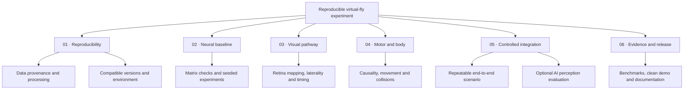

# MaleCNS development roadmap

The first milestone is a reproducible, inspectable visual-input-to-behaviour demo. This roadmap is a proposed sequence derived from the existing source, not a delivery commitment. Existing scripts are prototypes; their presence does not mean a milestone has passed validation.

## Working sheet

[Download the editable workbook](MaleCNS-Roadmap.xlsx) or [view the CSV](roadmap.csv). Status values: **Next**, **Planned**, **Exploratory**, **In progress**, **Done**. Initial statuses are planning choices, not independently verified delivery estimates. Mark Done only when the acceptance criterion has evidence.

| ID | Deliverable | Status | Depends on | Acceptance criterion |
| --- | --- | --- | --- | --- |
| R01 | Document the exact data pipeline | Next | None | A fresh machine produces compatible neuron tables and matrices. |
| R02 | Select compatible script versions | Next | None | One documented engine / vision / overlay combination. |
| R03 | Lock and verify the environment | Planned | R02 | Clean Python 3.12 install with tested dependency versions. |
| R04 | Validate matrix and neuron alignment | Planned | R01 | Checked dimensions, ordering, signs and matrix orientation. |
| R05 | Establish seeded neural baselines | Planned | R03, R04 | Repeatable stimulus and recovery results with recorded seeds. |
| R06 | Validate left / right and retina mapping | Planned | R01, R04 | Controlled stimuli produce documented laterality responses. |
| R07 | Profile capture and encoding latency | Planned | R02, R06 | Latency measurements with hardware and capture settings. |
| R08 | Check neural-to-motor causality | Planned | R05 | Controlled activation and ablation tests with clear metrics. |
| R09 | Verify movement and environment contacts | Planned | R02, R08 | Repeatable grounded, airborne and collision scenarios. |
| R10 | Build one controlled end-to-end scenario | Planned | R06, R07, R09 | A documented input-to-behaviour demo that can be rerun. |
| R11 | Evaluate optional Gemini perception | Exploratory | R10 | Document usefulness, cost, privacy and failure handling. |
| R12 | Benchmark the complete loop | Planned | R10 | Publish measured latency and stability with reproducible setup. |
| R13 | Record a clean demonstration | Planned | R10, R12 | A demo without private desktop content, with known limitations. |
| R14 | Document asset provenance and choose code license | Next | None | Code, data and model terms clearly distinguished. |

## Boundaries

- No completion percentage or target date has been invented.
- The release contains source and documentation, not the full scientific data.
- The anatomy dataset does not automatically supply validated neural dynamics or behaviour.
- The optional Gemini path is exploratory and separate from claims about connectome-driven behaviour.
- Performance claims require measurements with hardware, seeds and parameters recorded.

Planning basis: repository source inspection and the maintainer's stated student-project direction. Scientific data source: [official MaleCNS project](https://male-cns.janelia.org/).
